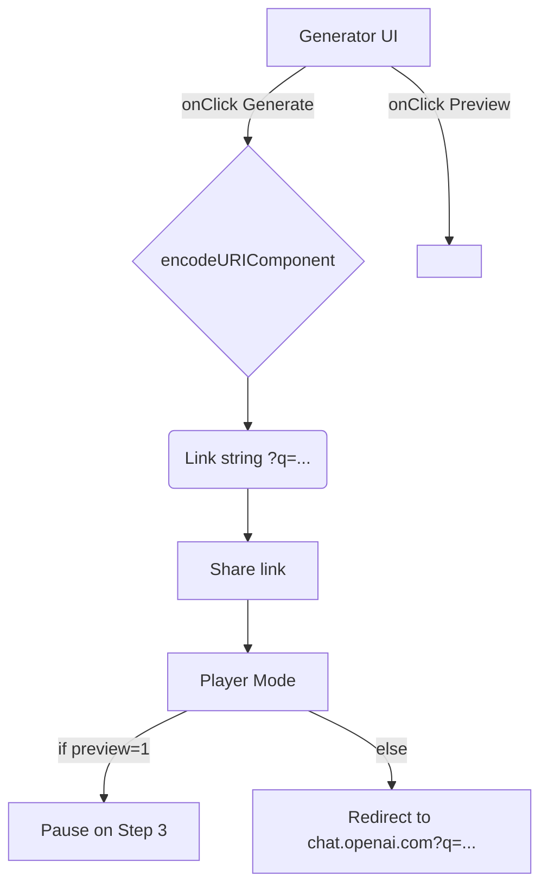

# LMCTFY v0 – Developer Specification

**Compiled:** 30 Jul 2025
**Project Lead:** Prateek Rungta
**Repo:** [github.com/prateek/lmctfy.ai](https://github.com/prateek/lmctfy.ai)

---

## 1. Project Overview

| Item           | Decision / Value                                                                  |
| -------------- | --------------------------------------------------------------------------------- |
| **Goal**       | Replicate LMGTFY but for ChatGPT – single-page tool that ends at ChatGPT          |
| **Domain**     | `lmctfy.ai`                                                                       |
| **Deployment** | Cloudflare Pages (static, single-file)                                            |
| **Repo**       | Public, MIT, [github.com/prateek/lmctfy.ai](https://github.com/prateek/lmctfy.ai) |
| **CI/CD**      | GitHub Actions: test on every push/PR; deploy main branch to Cloudflare Pages     |

---

## 2. Functional Requirements

### 2.1 Link Generator Mode (default / no `?q=` param)

* **Prompt Input:**

  * Single-line `<textarea>`, placeholder:
    *Type the question they should’ve asked ChatGPT…*
  * Multi-line support (newlines = literal in animation)
  * 16,000 char cap; error if exceeded.
* **Generate Button:**

  * On click:

    * Encode prompt with `encodeURIComponent`
    * Generate link: `https://lmctfy.ai/?q=<encoded>`
    * Display below:

      * **Copy**: Copies link (toast on success/failure)
      * **Preview**: Inline `<iframe>` (16:9, 640x360 desktop, full-width mobile), loads with `?q=...&preview=1`
      * New preview replaces previous; no close/clear.
* **Empty Prompt:**

  * Toast: *“Please enter a question.”*
* **Footer:**

  * Small: *Not affiliated with OpenAI · Made by GitHub / Twitter*
* **Prompt Length Error:**

  * Toast: *“Prompt is too long (16K max).”*

### 2.2 Animation/Player Mode (`?q=` param present)

* **Steps:**

  | Step | Visual / Action                                                                                 | Overlay Copy                   |
  | ---- | ----------------------------------------------------------------------------------------------- | ------------------------------ |
  | 0    | Blank browser window                                                                            | Step 1 · Go to chat.openai.com |
  | 1    | Types chat.openai.com, hits Enter                                                               | Step 2 · Type your question    |
  | 2    | Shows mock ChatGPT (light, title, empty chat, rounded input + "Send")<br/>Types prompt (\~9cps) | Step 3 · Hit Send              |
  | 3    | Presses Enter, “sends”                                                                          | …Was that so hard? (1.5s)      |
  | 4    | **Redirect**: `https://chat.openai.com/?q=...` (unless preview=1, then pauses on Step 3)        |                                |

* **Preview Mode:**

  * `&preview=1` flag pauses at Step 3, no redirect.

* **No skip/FF controls.**

* **Timing:**

  * Typing: \~9 chars/sec
  * 0.5s between steps
  * 1.5s at final overlay before redirect

---

## 3. Non-Functional Requirements

| Category        | Requirement                                                                    |
| --------------- | ------------------------------------------------------------------------------ |
| Tech stack      | **Vanilla** HTML + embedded CSS/JS (single `index.html`), **no external deps** |
| Responsive      | Usable on desktop and mobile                                                   |
| Browser support | Latest + previous release: Chrome, Firefox, Safari (incl. iOS), Edge           |
| Dark mode       | Not in scope (defer v1)                                                        |
| Accessibility   | Basic semantics only (a11y deferred to v1)                                     |
| SEO/Robots      | Indexable; generic OG/Twitter meta tags only; text-only, no images             |
| Title           | “Ask ChatGPT Instantly”                                                        |
| Description     | “Jump straight into ChatGPT with one click.”                                   |
| Favicon         | 16x16 chat-bubble, white bg, inline Base64 is fine                             |

---

## 4. Architecture & Data Flow



* Single `index.html` inspects `location.search`.
* If no `q`, show Generator UI.
* If `q` present, run animation (Player Mode).
* If `&preview=1`, pause at Step 3.
* **All state in URL only** (no cookies/localStorage).
* Prompt 16K cap ensures URL < Cloudflare’s 16KB limit.

---

## 5. Error Handling

| Situation          | Handling                                             |
| ------------------ | ---------------------------------------------------- |
| Empty prompt       | Toast + refocus input                                |
| >16K prompt        | Toast: “Prompt is too long (16K max).”               |
| Clipboard failure  | Error toast: “Couldn’t copy — please copy manually.” |
| Unsupported params | Ignore silently                                      |
| JS disabled        | `<noscript>` banner: “LMCTFY requires JavaScript.”   |

---

## 6. Testing Plan

| Layer       | Tests                                                                         | Tooling                       |
| ----------- | ----------------------------------------------------------------------------- | ----------------------------- |
| Unit        | - encodeURIComponent round-trip<br/>- 16K length cap<br/>- error msg triggers | Jest (+jsdom)                 |
| Integration | - Generator → Preview iframe loads<br/>- Player flow → redirect within \~N s  | Playwright/Cypress (optional) |
| CI          | GitHub Actions: `npm test` on every push/PR; block deploy if fails            |                               |

---

## 7. GitHub Actions / Deployment

* **Secrets:**

  * `CF_API_TOKEN` (Cloudflare Pages deploy token)
* **Workflow** (`.github/workflows/deploy.yml`):

  1. `npm ci` (tests only, not for build)
  2. `npm test`
  3. If `branch == main` && tests pass → `wrangler pages publish ./ --project-name lmctfy-ai`

---

## 8. File/Folder Structure

```
/
├─ index.html   # single file; embedded <style> and <script>
├─ LICENSE
└─ README.md    # quick-start & deploy steps (no deep design doc)
```

---

## 9. Open Items for Developer

1. **Overlay Copy:**
   * Use classic LMGTFY tone, short/snarky (per 2.2 above)

2. **Mock ChatGPT Visuals:**
   * Title, empty chat pane, rounded input, Send button (light mode)

3. **Timing:**
   * Fine-tune char/sec and pauses for “medium” feel

4. **Favicon:**
   * Minimalist chat-bubble, white background

> **Everything else is specified — implementation can begin.**

